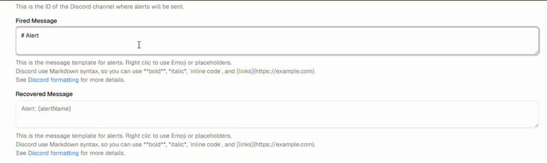

<p align="center">    
  
</p> 


A **simple alerting system for Kibana**.  
You can create multiple *alerters* for each rule defined in Kibana.  

⚠️ This project is still under development (i'm more an Ops than a Dev and this is my first real project 🎉).  
It uses **NestJS** for the backend, **NextJS** for the frontend, and **Elasticsearch** as the storage layer.  

This is a early stage of the project, so there are still bugs and issues. 


---


## ✅ Current Features

- 🔔 **Discord Alerters**  ([Discord Bot](https://discord.com/developers/docs/quick-start/overview-of-apps)) 
- 💬 **Slack Alerters**  ([Slack App](https://api.slack.com/apps))
- 📧 **Email Alerters**  (SMTP)
- 🚨 **Teams Alerters** ([Webhook](https://learn.microsoft.com/fr-fr/microsoftteams/platform/webhooks-and-connectors/how-to/add-incoming-webhook?tabs=newteams%2Cdotnet) & [AdaptiveCards](https://adaptivecards.microsoft.com/designer))
- 😱 **Emoji & placeholders** 
- 🖍️ **Rule selection**

<p align="center">
  
</p>

 
---

## 🚀 Quick Start

### 1. Clone the repository

```bash
git clone https://github.com/Lucasp381/kib.A.git
cd kib.A
```

### 2. Start Elasticsearch & Kibana locally

```bash
curl -fsSL https://elastic.co/start-local | sh
```

### 3. Create `.env` files

#### 📂 .env
```env
KIBANA_URL="http://host.docker.internal:5601" # URL for Kibana instance
ELASTIC_URL="http://host.docker.internal:9200" # Elasticsearch node URL
ELASTIC_API_KEY='API-KEY-HERE' # Replace with your actual API key
KIBA_INDEX_PREFIX="kiba" # Prefix for Kib.A indices allow multiple instances
POLL_EVERY=10 # Time in seconds to poll Elasticsearch for new alerts
ENCRYPTION_KEY="xxxxxxxxxxxxxxxxxxxxxxxxxxxxxxxxxxxxxxxxxxx=" # Encryption key for sensitive data ( openssl  rand -base64 32 )
```


### 4. Start Kiba

```bash
docker compose up --build
```

### 5. Access WebUI

first run, init elasticsearch indexes : `http://localhost:8080/api/internal/init`

```bash
http://localhost:8080
```

### 6. Create alerters

**Discord**: 
- Require a Discord Bot Token
- Channel ID

**Slack**:
- Require Slack Apps token
- Permissions:
  - channels:read
  - chat:write
  - chat:write.public
  - 
**Teams**:
- Webook url

**Email**:
- Require SMTP server 
- username & password

## Tips
- You can add `KIBANA_URL` variable in settings > Variables to be able to double click on alerts and rules in the Dashboard

## 🛠 Tech Stack

- [NestJS](https://nestjs.com/) – Backend  
- [NextJS](https://nextjs.org/) – Frontend  
- [Elasticsearch](https://www.elastic.co/elasticsearch/) – Storage  

---

## 📌 Roadmap

- [x] UI for managing alerters  
- [x] Add Microsoft Teams integration  
- [X] Dockerized deployment
- [ ] Add Telegram & Custom alerters
- [ ] Scheduled mute windows

---

## Screenshots
|                                                        |                                                       |
| ----------------------------------------------------------- | ---------------------------------------------------------- |
|                                  | |
|                           | |
|                             | |


