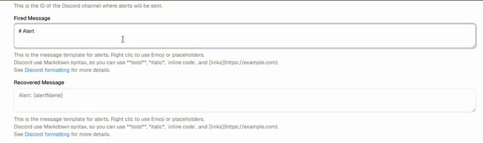

<p align="center">    
  
</p> 


A **simple alerting system for Kibana**.  
You can create multiple *alerters* for each rule defined in Kibana.  

⚠️ This project is still under development (i'm not a real developper and this is my first real project 🎉).  
It uses **NestJS** for the backend, **NextJS** for the frontend, and **Elasticsearch** as the storage layer.  

This is a early stage of the project, so there are still bugs and issues. 


---


## ✅ Current Features

- 🔔 **Discord Alerters**  
- 💬 **Slack Alerters**  
- 📧 **Email Alerters**  
- 😱 **Emoji & placeholders** 
- 🖍️ **Rule selection**

<p align="center">
  
</p>

 
---

## 🚀 Quick Start

### 1. Clone the repository

```bash
git clone https://github.com/Lucasp381/kib.A.git
cd kib.A
```

### 2. Start Elasticsearch & Kibana locally

```bash
curl -fsSL https://elastic.co/start-local | sh
```

### 3. Create `.env` files

#### 📂 .env
```env
KIBANA_URL="http://host.docker.internal:5601" # URL for Kibana instance
ELASTIC_URL="http://host.docker.internal:9200" # Elasticsearch node URL
ELASTIC_API_KEY='API-KEY-HERE' # Replace with your actual API key
KIBALERT_INDEX_PREFIX="kibalert" # Prefix for Kibalert indices allow multiple instances
POLL_EVERY=10 # Time in seconds to poll Elasticsearch for new alerts
ENCRYPTION_KEY="xxxxxxxxxxxxxxxxxxxxxxxxxxxxxxxxxxxxxxxxxxx=" # Encryption key for sensitive data ( openssl  rand -base64 32 )
```


### 4. Start Kiba

```bash
docker compose up --build
```


### 5. Access WebUI

```bash
http://localhost:8080
```


## 🛠 Tech Stack

- [NestJS](https://nestjs.com/) – Backend  
- [NextJS](https://nextjs.org/) – Frontend  
- [Elasticsearch](https://www.elastic.co/elasticsearch/) – Storage  

---

## 📌 Roadmap

- [x] UI for managing alerters  
- [ ] Add Microsoft Teams integration  
- [ ] Dockerized deployment  
- [ ] Improved multi-environment configuration  

---

## 📜 License

MIT © 2025 – [Lucasp381](https://github.com/Lucasp381)
